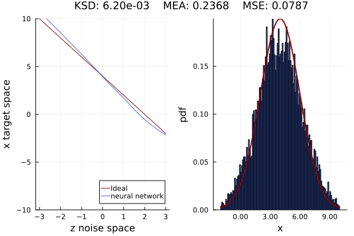

# README
[](https://arxiv.org/abs/2402.16435)
[](https://josemanuel22.github.io/ISL/dev/) [](https://app.codecov.io/gh/josemanuel22/ISL)

This repository contains the Julia Flux implementation of the Invariant Statistical Loss (ISL) proposed in the paper [Training Implicit Generative Models via an Invariant Statistical Loss](https://arxiv.org/abs/2402.16435), published in the AISTATS 2024 conference.

Please, if you use this code, cite the [article](https://arxiv.org/abs/2402.16435):

```
@misc{defrutos2024training,
      title={Training Implicit Generative Models via an Invariant Statistical Loss}, 
      author={José Manuel de Frutos and Pablo M. Olmos and Manuel A. Vázquez and Joaquín Míguez},
      year={2024},
      eprint={2402.16435},
      archivePrefix={arXiv},
      primaryClass={cs.LG}
}
``````

## Overview of the ISL Repository Structure

The `ISL` repository is organized into several directories that encapsulate different aspects of the project, ranging from the core source code and custom functionalities to examples demonstrating the application of the project's capabilities, as well as testing frameworks to ensure reliability.

### Source Code (`src/`)

- **`CustomLossFunction.jl`**: This file contains implementations of the ISL custom loss function tailored for the models developed within the repository.
  
- **`ISL.jl`**: Serves as the main module file of the repository, this file aggregates and exports the functionalities developed in `CustomLossFunction.jl`.

### Examples (`examples/`)

- **`time_series_predictions/`**: This subdirectory showcases how the ISL project's models can be applied to time series prediction tasks. 

- **`Learning1d_distribution/`**: Focuses on the task of learning 1D distributions with the ISL.

### Testing Framework (`test/`)

- **`runtests.jl`**: This script is responsible for running automated tests against the `ISL.jl` module.

## How to install

To install ISL, simply use Julia's package manager. The module is not registered so you need to clone the repository and follow the following steps:

````
julia> push!(LOAD_PATH,pwd()) # You are in the ISL Repository
julia> using ISL
````

To reproduce the enviroment for compiling the repository:
````
(@v1.9) pkg>  activate pathToRepository/ISL
````

If you want to use any utility subrepository like GAN or DeepAR, make sure it's within your path.

# Usage

To make simple use, once the package is installed, just run the examples. For instance, execute,

```julia
# This example is from examples/Learning1d_distribution/benchmark_unimodal.jl
# We include the module
using ISL
include("../utils.jl")

@test_experiments "N(0,1) to N(23,1)" begin
    # Generator: a neural network with ELU activation
    gen = Chain(Dense(1, 7), elu, Dense(7, 13), elu, Dense(13, 7), elu, Dense(7, 1))

    # Discriminator: a neural network with ELU activation and σ activation function in the last layer
    dscr = Chain(
        Dense(1, 11), elu, Dense(11, 29), elu, Dense(29, 11), elu, Dense(11, 1, σ)
    )

    #Noise model
    noise_model = Normal(0.0f0, 1.0f0)
    n_samples = 10000   
    # Target model composed of a mixture of models
    target_model = Normal(4.0f0, 2.0f0)

    # Parameters for automatic invariant statistical loss
    hparams = AutoISLParams(;
        max_k=10, samples=1000, epochs=1000, η=1e-2, transform=noise_model
    )

    # Preparing the training set and data loader
    train_set = Float32.(rand(target_model, hparams.samples))
    loader = Flux.DataLoader(train_set; batchsize=-1, shuffle=true, partial=false)

    # Training using the automatic invariant statistical loss
    auto_invariant_statistical_loss(gen, loader, hparams)

    #We plot the results
    plot_global(
        x -> quantile.(-target_model, cdf(noise_model, x)),
        noise_model,
        target_model,
        gen,
        n_samples,
        (-3:0.1:3),
        (-2:0.1:10),
    )
end
```


# Contributors

[José Manuel de Frutos](https://josemanuel22.github.io/)

For further information: jofrutos@ing.uc3m.es