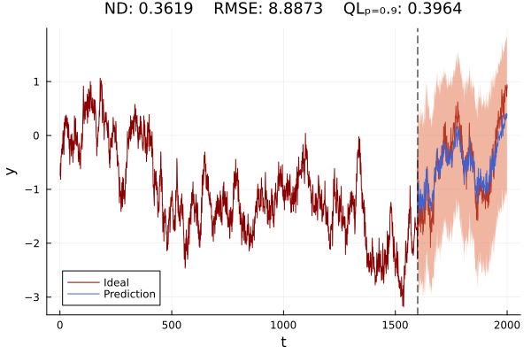

To make simple use, once the package is installed, just run the examples in `examples/` directory.

# Learning 1-D distributions

```julia
# This example is from examples/Learning1d_distribution/benchmark_unimodal.jl
# We include the module
using ISL
include("../utils.jl")

@test_experiments "N(0,1) to N(23,1)" begin
    # Generator: a neural network with ELU activation
    gen = Chain(Dense(1, 7), elu, Dense(7, 13), elu, Dense(13, 7), elu, Dense(7, 1))

    # Discriminator: a neural network with ELU activation and σ activation function in the last layer
    dscr = Chain(
        Dense(1, 11), elu, Dense(11, 29), elu, Dense(29, 11), elu, Dense(11, 1, σ)
    )

    #Noise model
    noise_model = Normal(0.0f0, 1.0f0)
    n_samples = 10000   
    # Target model composed of a mixture of models
    target_model = Normal(4.0f0, 2.0f0)

    # Parameters for automatic invariant statistical loss
    hparams = AutoISLParams(;
        max_k=10, samples=1000, epochs=1000, η=1e-2, transform=noise_model
    )

    # Preparing the training set and data loader
    train_set = Float32.(rand(target_model, hparams.samples))
    loader = Flux.DataLoader(train_set; batchsize=-1, shuffle=true, partial=false)

    # Training using the automatic invariant statistical loss
    auto_invariant_statistical_loss(gen, loader, hparams)

    #We plot the results
    plot_global(
        x -> quantile.(-target_model, cdf(noise_model, x)),
        noise_model,
        target_model,
        gen,
        n_samples,
        (-3:0.1:3),
        (-2:0.1:10),
    )
end
```


# Time Series

```julia
@test_experiments "testing AutoRegressive Model 1" begin
    # --- Model Parameters and Data Generation ---

    # Define AR model parameters
    ar_hparams = ARParams(;
        ϕ=[0.5f0, 0.3f0, 0.2f0],  # Autoregressive coefficients
        x₁=rand(Normal(0.0f0, 1.0f0)),  # Initial value from a Normal distribution
        proclen=2000,  # Length of the process
        noise=Normal(0.0f0, 0.2f0),  # Noise in the AR process
    )

    # Define the recurrent and generative models
    recurrent_model = Chain(RNN(1 => 10, relu), RNN(10 => 10, relu))
    generative_model = Chain(Dense(11, 16, relu), Dense(16, 1, identity))

    # Generate training and testing data
    n_series = 200  # Number of series to generate
    loaderXtrain, loaderYtrain, loaderXtest, loaderYtest = generate_batch_train_test_data(
        n_series, ar_hparams
    )

    # --- Training Configuration ---

    # Define hyperparameters for time series prediction
    ts_hparams = HyperParamsTS(;
        seed=1234,
        η=1e-3,  # Learning rate
        epochs=n_series,
        window_size=1000,  # Size of the window for prediction
        K=10,  # Hyperparameter K (if it has a specific use, add a comment)
    )

    # Train model and calculate loss
    loss = ts_invariant_statistical_loss_one_step_prediction(
        recurrent_model, generative_model, loaderXtrain, loaderYtrain, ts_hparams
    )

    # --- Visualization ---

    # Plotting the time series prediction
    plot_univariate_ts_prediction(
        recurrent_model,
        generative_model,
        collect(loaderXtrain)[2],  # Extract the first batch for plotting
        collect(loaderXtest)[2],  # Extract the first batch for plotting
        ts_hparams;
        n_average=1000,  # Number of predictions to average
    )
end
```

    


```julia
@test_experiments "testing electricity-c" begin
     # Data loading and preprocessing
    csv_file_path = "examples/time_series_predictions/data/LD2011_2014.txt"

    # Specify custom types for certain columns to ensure proper data handling
    column_types = Dict(
        "MT_005" => Float32,
        "MT_006" => Float32,
        "MT_007" => Float32,
        "MT_008" => Float32,
        "MT_168" => Float32,
        "MT_333" => Float32,
        "MT_334" => Float32,
        "MT_335" => Float32,
        "MT_336" => Float32,
        "MT_338" => Float32,
    )

    df = DataFrame(
        CSV.File(csv_file_path; delim=';', header=true, decimal=',', types=column_types)
    )

    # Hyperparameters setup
    hparams = HyperParamsTS(; seed=1234, η=1e-2, epochs=2000, window_size=1000, K=10)

    # Model definition
    rec = Chain(RNN(1 => 3, relu), RNN(3 => 3, relu))
    gen = Chain(Dense(4, 10, identity), Dense(10, 1, identity))

    # Training and testing data setup
    start, num_training_data, num_test_data = 35040, 35040, 1000

    # Aggregate time series data for training and testing
    selected_columns = [
        "MT_005",
        "MT_006",
        "MT_007",
        "MT_008",
        "MT_168",
        "MT_333",
        "MT_334",
        "MT_335",
        "MT_336",
        "MT_338",
    ]

    loader_xtrain, loader_ytrain, loader_xtest = aggregate_time_series_data(
        df, selected_columns, start, num_training_data, num_test_data
    )

    # Model training
    losses = []
    @showprogress for _ in 1:100
        loss = ts_invariant_statistical_loss(
            rec, gen, loader_xtrain, loader_ytrain, hparams
        )
        append!(losses, loss)
    end

    # Forecasting
    τ = 24
    xtrain = collect(loaderXtrain)[1]
    xtest = collect(loaderXtest)[1]
    prediction, stds = ts_forecast(
        rec, gen, xtrain, xtest, τ; n_average=1000, noise_model=Normal(0.0f0, 1.0f0)
    )
    plot(prediction[1:τ])
    plot!(xtest[1:τ])
end
```
`Prediction τ = 24 (1 day)`
    

`Prediction τ = 168 (7 days)`
    

